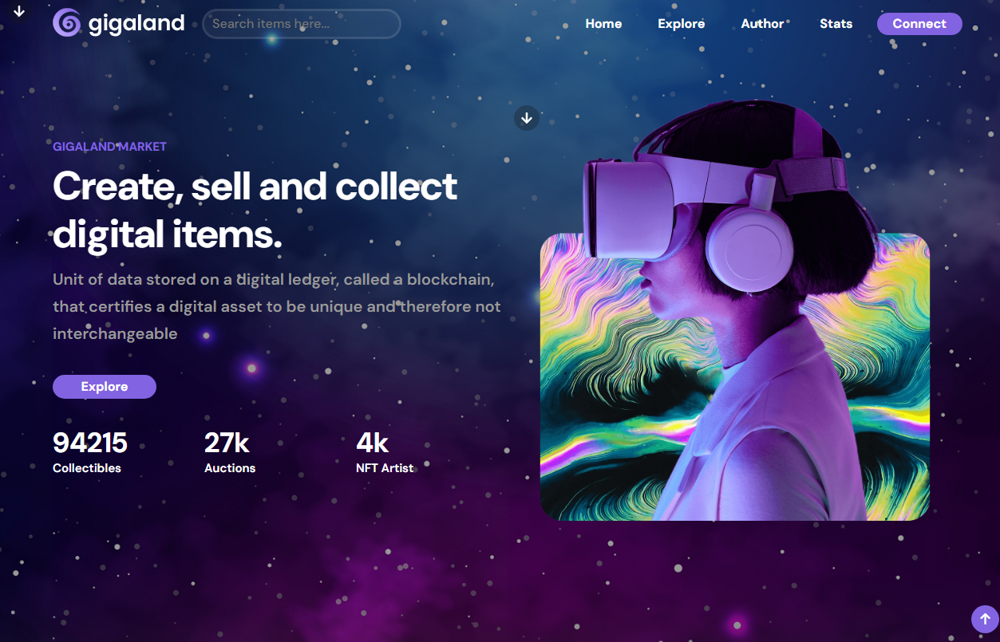

# Gigaland - NFT Marketplace

Gigaland is a vibrant NFT marketplace that allows users to create, sell, and collect unique digital assets using blockchain technology. With its cosmic theme and user-friendly interface, Gigaland provides an immersive experience for both creators and collectors.

## Overview

Gigaland is a platform where users can:
- **Create NFTs:** Mint your own digital art or virtual items as NFTs.
- **Sell and Buy NFTs:** List your NFTs for sale or purchase from a wide range of collections.
- **Explore Collections:** Browse themed collections, including the popular "Cosmic" collection.
- **Discover Top Sellers:** Find trending NFTs from the most successful creators.
- **Wallet Integrations:** Connect seamlessly with wallets like Bitaki, Formatic, Coinbase Wallet, or Arkane.

The marketplace is designed with a cosmic theme, offering an engaging and visually appealing experience for users.

## Features

- **Create NFTs:** Easily mint your own NFTs and showcase your digital art or virtual items.
- **Sell and Buy:** List your NFTs for sale or browse and purchase from a wide range of collections.
- **Collections:** Explore various themed collections, including the popular "Cosmic" collection.
- **Top Sellers:** Discover the most successful creators and their trending NFTs.
- **Wallet Integrations:** Seamlessly connect your wallet using Bitaki, Formatic, Coinbase Wallet, or Arkane.

## Getting Started

1. **Create an Account:** Sign up for a Gigaland account to start exploring the marketplace.
2. **Connect Your Wallet:** Choose your preferred wallet integration to manage your NFTs and transactions.
3. **Explore Collections:** Browse through the diverse collections and find NFTs that catch your eye.
4. **Create or Buy:** Start creating your own NFTs or purchase from the marketplace to build your collection.

## Technologies Used

- HTML5
- CSS3
- JavaScript

## Author

Gigaland is created by A7hmed Hussien.

## Links

- **Live Demo:** [Gigaland Live Demo](https://eng-ahmed-hussien.github.io/Gigaland-Landing/)
- **GitHub Repository:** [Gigaland Repository](https://github.com/eng-ahmed-hussien/Gigaland-Landing)

## Screenshot

## Contact

For any inquiries or support, please contact A7hmed Hussien at [email@example.com].